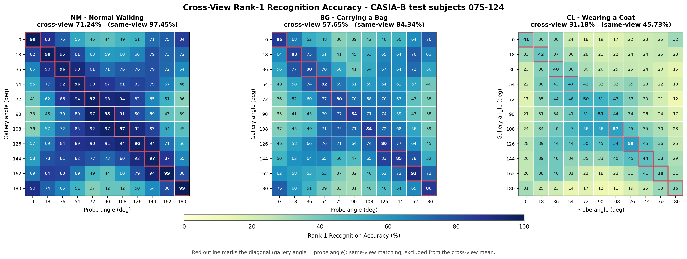
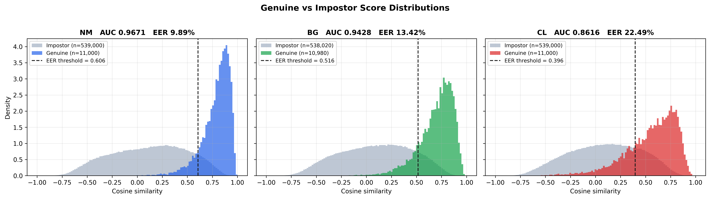

# Cross-View Gait Recognition via Multimodal Fusion

### A Deep Learning Pipeline for Human Identification Combining a Modified GaitSet Backbone with Multimodal Feature Fusion

---

## Introduction

Gait is a behavioral biometric — it identifies people by how they walk rather than by a static physical trait. Because it can be captured from a distance and does not require the subject's cooperation, unlike face or fingerprint recognition, gait analysis is well suited to surveillance, forensics, and security applications.

This repository contains a full implementation of a multimodal gait recognition framework built on a modified GaitSet backbone, based on the paper *"Research on Gait Recognition Based on GaitSet and Multimodal Fusion."*

Rather than relying on silhouettes alone, the system fuses Silhouette Images with Gait Energy Images (GEI) through a channel attention-based fusion module, allowing the network to capture both the spatial structure of the body and the temporal rhythm of the gait cycle.

The pipeline was trained and evaluated on the CASIA-B benchmark across three walking conditions:

- Normal walking (NM)
- Carrying a bag (BG)
- Wearing a coat (CL)

End to end, the project covers video preprocessing, silhouette extraction, GEI generation, multimodal feature fusion, deep embedding learning, Rank-1 identification, and open-set verification (ROC / EER).

---

## Key Features

- Modified GaitSet backbone with multimodal fusion
- Joint learning from silhouette images and GEI
- Channel attention for adaptive feature weighting
- End-to-end CASIA-B preprocessing pipeline
- Cross-view recognition support
- Cosine-similarity-based Rank-1 identification
- Verification via ROC-AUC and Equal Error Rate (EER)
- PyTorch implementation, GPU-accelerated
- Modular codebase for experimentation

---

## Architecture

The framework builds on GaitSet by adding a multimodal feature fusion stage that combines silhouette images with gait energy images. A channel attention module adaptively weights the two feature streams before they are merged into a single gait embedding, which is used for both identification and verification.

<p align="center">
  
</p>

<p align="center">
<b>Figure 1.</b> End-to-end pipeline of the modified GaitSet multimodal framework.
</p>

---

## Repository Layout

```text
Gait-Multi-Modal-Fusion
│
├── docs/                     # Images used in this README (architecture, results)
│
├── GaitDatasetB-silh/         # Raw CASIA-B silhouettes
│
├── Processed_CASIAB/          # Preprocessed data (.npy)
│
├── results/                   # Evaluation outputs and plots
│
├── baseline_results/          # Baseline experiment outputs
│
├── gait_env/                  # Optional virtual environment
│
├── preprocess.py              # Preprocessing pipeline
├── pack_npy.py                # Converts processed frames to .npy
├── dataset.py                 # CASIA-B dataset loader
├── model.py                   # Modified GaitSet model definition
├── train.py                   # Training script
├── eval.py                    # Rank-1 evaluation
├── compute_biometrics.py      # ROC / AUC / EER computation
├── plot_view_matrix.py        # Cross-view accuracy heatmap
│
├── requirements.txt
└── README.md
```

---

## Background

Gait recognition identifies people from the pattern of their walk. Because it works at a distance and does not require cooperation, it has drawn sustained interest for surveillance, border control, forensics, and smart-city applications.

The original GaitSet model treated a walking sequence as an unordered set of silhouette frames, a design that pushed cross-view recognition forward considerably. Its main weakness is that it depends entirely on silhouette shape, which makes it sensitive to anything that changes the outline of the body, such as heavy coats or carried bags.

This project addresses that limitation with a modified GaitSet architecture, following the approach described in *"Research on Gait Recognition Based on GaitSet and Multimodal Fusion."* Instead of a single silhouette stream, the model fuses silhouette images with gait energy images (GEI) through a channel attention-based fusion module, so the network learns from:

- Spatial body shape, from silhouettes
- Temporal walking dynamics, from GEI
- An adaptively weighted combination of the two, via channel attention

The resulting embeddings are more discriminative and more resilient to appearance changes than a silhouette-only baseline.

---

## Dataset

Training and evaluation were carried out on CASIA-B, one of the standard benchmarks for cross-view gait recognition.

| Property | Value |
|----------|-------|
| Dataset | CASIA-B |
| Subjects | 124 |
| Camera views | 11 (0°–180°) |
| Walking conditions | Normal (NM), Bag (BG), Coat (CL) |
| Gallery subjects | 75–124 |
| Probe sequences | NM, BG, CL |
| Gallery sequences | NM-01 to NM-04 |

CASIA-B's range of viewpoints and appearance conditions makes it a demanding, and informative, testbed for this type of model.

---

## Getting Started

To reproduce the results or train the model from scratch, see the full setup walkthrough, covering installation, environment configuration, dataset preparation, and training.

**[Getting Started Guide](docs/GETTING_STARTED.md)**

---

## Results & Performance

This section covers how the model trained, how accurately it identifies subjects, how well it performs at verification, and what its attention mechanism learned over the course of training.

### Evaluation Protocol

Protocol choices move these numbers substantially, so they are stated up front. Gallery and probe sets come from subjects 075–124, which are disjoint from the 74 identities used in training.

| Item | Setting |
|:-----|:--------|
| Gallery | `nm-01`–`nm-04`, averaged into one template per (subject, angle) — 550 templates |
| Probes | NM: `nm-05`, `nm-06` · BG: `bg-01`, `bg-02` · CL: `cl-01`, `cl-02` |
| Matching | Cosine similarity on 256-D L2-normalised embeddings |
| Frames | All frames per sequence; Set Pooling is invariant to sequence length |
| Cross-view averaging | All 11 × 11 gallery/probe angle pairs, excluding the identical-view diagonal |
| Verification pairing | Every probe against every template, identical-view pairs excluded |

Matching a probe against gallery footage from the *same* camera angle is a considerably easier problem than genuine cross-view recognition, so the diagonal is excluded from the headline figures. Both are reported below, since the gap between them is itself informative.

Evaluation is deterministic for a fixed `--frame-budget`, though changing it can shift individual figures by up to about 0.1 point: batch shapes change, cuDNN selects different convolution algorithms, and the resulting floating-point differences flip a small number of near-tied nearest-neighbour decisions. Only CL is measurably affected, as it has the narrowest genuine/impostor margin. All figures here use the default budget of 768.

### Summary

| Metric | Cross-view | Same-view |
|:-------|:----------:|:---------:|
| Overall Rank-1 accuracy | **53.36%** | 75.84% |
| Normal walking (NM) | **71.24%** | 97.45% |
| Bag carrying (BG) | **57.65%** | 84.34% |
| Coat wearing (CL) | **31.18%** | 45.73% |

| Verification | AUC | EER | Threshold |
|:-------------|:---:|:---:|:---------:|
| Normal walking (NM) | **0.9671** | **9.89%** | 0.6063 |
| Bag carrying (BG) | **0.9428** | **13.42%** | 0.5163 |
| Coat wearing (CL) | **0.8616** | **22.49%** | 0.3961 |
| Combined | **0.9215** | **15.98%** | 0.4920 |

The model identifies subjects reliably under normal walking and degrades predictably as appearance changes: a carried bag costs roughly 14 points of Rank-1 accuracy, heavy clothing around 40. Verification is markedly stronger than identification, which is expected — deciding whether a single pair matches is an easier problem than selecting the right identity from 50 candidates. Clothing remains the clear weak point.

### Training Behavior

Training was tracked using cross-entropy loss, batch-all triplet loss, and training accuracy over 150 epochs.

<p align="center">
  
</p>

<p align="center">
<b>Figure 2.</b> Cross-entropy loss, batch-all triplet loss, and training accuracy over 150 epochs.
</p>

Cross-entropy loss falls steadily, reflecting improving classification ability. Batch-all triplet loss drops substantially, showing that embeddings for the same identity are pulled together while different identities are pushed apart. Training accuracy rises consistently across epochs. Overall, training converges smoothly, with no signs of instability in the optimization.

### Identification Results

Rank-1 accuracy, the percentage of probes correctly matched to their identity as the top candidate, was measured separately for NM, BG, and CL conditions. The full 11 × 11 matrix is reported rather than a single averaged figure, since performance depends heavily on the angle between the gallery and probe cameras.

<p align="center">
  
</p>

<p align="center">
<b>Figure 3.</b> Cross-view Rank-1 accuracy for every gallery/probe angle pair. Rows are gallery angles, columns are probe angles. The red-outlined diagonal is same-view matching and is excluded from the cross-view mean.
</p>

Normal walking achieved the best result, at 71.24%, reflecting the case where appearance variation is minimal and the model can rely on clean gait signal. Accuracy exceeds 90% for angle gaps up to roughly 36° and decays as the viewpoint difference widens. Bag carrying dropped to 57.65%, a meaningful decline but one the fusion strategy handles reasonably given that a carried object corrupts part of the silhouette while leaving the underlying gait dynamics intact. Coat wearing fell to 31.18%, by far the largest drop. Heavy clothing substantially alters the silhouette, and because the current architecture collapses the fused feature map into a single global embedding, a coat contaminates the whole descriptor rather than only the affected body region.

The aggregate cross-view accuracy of 53.36% reflects solid performance on the easier conditions offset by the difficulty of the CL scenario.

Three patterns in the matrix are worth noting, all of them physically meaningful rather than artefacts of the measurement. Accuracy falls monotonically as the gallery/probe angle gap widens, which is the expected signature of a view-dependent representation. The 0° and 180° columns are weakest, since a subject walking directly toward or away from the camera shows far less lateral limb motion. And pairs at opposite extremes recover noticeably — gallery 0° against probe 180° reaches 84% under NM — because those two viewpoints are near-mirror images of the same walking motion.

### Verification Results

Beyond identification, the framework was evaluated on its ability to distinguish genuine matches from impostors. This is the open-set question relevant to deployment: whether a *single* global similarity threshold can accept genuine pairs and reject impostors across identities the model has never seen.

<p align="center">
  
</p>

<p align="center">
<b>Figure 4.</b> ROC curves per walking condition and combined, computed from real gallery and probe embeddings with identical-view pairs excluded.
</p>

| Probe | AUC | EER | Threshold | Genuine mean | Impostor mean |
|:------|----:|----:|----------:|-------------:|--------------:|
| NM | 0.9671 | 9.89% | 0.6063 | +0.7908 | +0.1166 |
| BG | 0.9428 | 13.42% | 0.5163 | +0.7012 | +0.0956 |
| CL | 0.8616 | 22.49% | 0.3961 | +0.5603 | +0.0917 |
| Combined | 0.9215 | 15.98% | 0.4920 | +0.6841 | +0.1013 |

A combined AUC of 0.9215 indicates the embedding space separates genuine from impostor pairs well, rising to 0.9671 under normal walking alone. The corresponding EER — the point at which false acceptance and false rejection rates are equal — is 15.98% combined and 9.89% for NM.

The threshold is worth reading carefully, because it does not transfer across conditions. It falls from 0.61 under NM to 0.40 under CL as genuine-pair similarity degrades, so a deployed system running one fixed cutoff would either admit impostors under NM or turn away genuine users under CL. Reporting a single threshold without stating the condition it was tuned on would be misleading, which is why all four appear above.

<p align="center">
  
</p>

<p align="center">
<b>Figure 5.</b> Genuine and impostor cosine similarity distributions per condition. The overlap between the two is what sets the achievable EER.
</p>

Figure 5 shows why CL is the hardest case, and the mechanism is more specific than "clothing hurts." The impostor distribution barely moves across conditions, sitting near +0.10 throughout. What changes is the genuine distribution, which slides down and broadens from +0.79 under NM to +0.56 under CL. The failure is a loss of similarity between genuine pairs, not an increase in false matches — which points at feature extraction rather than at the decision rule.

### Attention Visualization

Attention maps were captured at several points during training to observe how the channel attention module's focus evolved.

<p align="center">
  
</p>

<p align="center">
<b>Figure 6.</b> Attention evolution at epochs 10, 50, 100, and 150 (warm colors indicate higher importance, cool colors indicate lower importance).
</p>

At epoch 10, attention is diffuse, and the model has not yet zeroed in on informative regions. By epoch 50, structure begins to emerge around body regions relevant to gait motion. By epoch 100, focus sharpens further, with background regions increasingly suppressed. By epoch 150, attention settles into a stable, well-localized pattern.

This progression, from broad exploration to targeted focus, tracks with the steady gains seen in the training curves and reflects successful convergence of the fusion mechanism.

---

## Limitations

**Sensitivity to clothing.** CL accuracy (31.18%) lags well behind NM and BG, since heavy or loose clothing obscures the silhouette that the model partly relies on. The single global embedding compounds this: because the fused feature map is flattened and projected into one vector, a coat degrades the entire descriptor rather than only the body region it covers.

**Aspect ratio is not preserved during preprocessing.** Silhouettes are cropped to their bounding box and resized to a square. The bounding box widens and narrows across the gait cycle as the limbs swing, so each frame is stretched by a different factor, and subject height is discarded entirely.

**No validation split.** Training runs for a fixed 150 epochs and saves the final checkpoint, so there is no guarantee the saved weights are the best ones, and no signal on overfitting to the 74 training identities.

**Verification thresholds are condition-specific.** The optimal cutoff varies from 0.61 (NM) to 0.40 (CL), so a single fixed threshold would not serve all conditions equally.

**Dependence on silhouette quality.** The pipeline's output is only as good as the silhouette extraction step; segmentation noise or incomplete masks degrade downstream features. A handful of CASIA-B test sequences contain as few as two usable frames, and these are evaluated as-is rather than excluded.

**Single-dataset evaluation.** All results reported here are on CASIA-B; generalization to other gait datasets has not been tested.

**Controlled-capture assumption.** The current setup does not account for poor lighting, occlusion, crowding, or uneven terrain, all of which are common in real-world deployments.

---

## Future Work

- Horizontal Pyramid Mapping in place of the single flattened embedding, so that a coat degrades only the affected body strips rather than the whole descriptor
- Height-preserving, centroid-aligned silhouette normalisation to remove the gait-cycle-dependent distortion noted above
- Larger PK batches for triplet mining, since the current P=4 gives each anchor only three candidate negatives to choose from
- Clothing-invariant feature extraction to close the CL performance gap, including entropy-based representations that encode only the moving regions of the body
- Skeleton- or pose-based features alongside silhouette and GEI for complementary motion cues
- A validation split with best-checkpoint selection instead of taking the final epoch
- Transformer-based or other advanced attention mechanisms for fusion
- Cross-dataset evaluation to test generalization beyond CASIA-B
- Adaptation to real-world surveillance conditions, including lighting, clutter, and occlusion
- Model compression and inference optimization for edge deployment

---

## Corrections to Previously Reported Results

An earlier revision of this README reported figures that were produced incorrectly. They have been replaced with measured values, and the causes are recorded here.

**Identification used a same-view protocol.** Each probe was matched only against gallery sequences recorded from its own camera angle, which is same-view rather than cross-view recognition. The previously reported NM 98.00% / BG 82.24% / CL 45.36% correspond to the diagonal of Figure 3 and remain reproducible as the same-view column in the Summary. The cross-view figures now reported follow the standard protocol with that diagonal excluded.

**Verification metrics were computed from random data.** `compute_biometrics.py` contained a test harness that generated `np.random.randn` vectors, and the scoring function was never called with real embeddings. The previously reported AUC 0.5876 / EER 44.94% / threshold 0.0094 were that harness's output; a near-chance AUC paired with a near-zero threshold is the signature of unrelated random vectors rather than of this model. The measured values are substantially better than the figures they replace.

**The cross-view matrix was generated by a formula.** `plot_view_matrix.py` filled each cell with `92.0 - (angle_distance * 6.5)` plus seeded noise and never loaded the model. Figure 3 is now computed from real embeddings.

Several changes were made to prevent this class of error from recurring. `eval.py` is now the only script that loads the model; it performs a single GPU pass and writes `results/embeddings.npz`, which the two reporting scripts consume rather than constructing their own inputs. Before reporting anything, `eval.py` runs a sanity check that asserts embeddings are unit-norm and prints mean genuine against mean impostor similarity, warning explicitly if the two are indistinguishable. `compute_biometrics.py` emits the score distributions in Figure 5 alongside the ROC, where a degenerate result is immediately visible rather than hidden inside a summary statistic.

---

## Acknowledgements

This project builds on prior open research and public datasets:

- **CASIA-B Gait Dataset**, the benchmark dataset used throughout this work.
- **[GaitSet: Cross-View Gait Recognition Through Utilizing Gait As a Deep Set](https://ieeexplore.ieee.org/document/9351667)**, the set-based representation this implementation extends.
- **[Research on Gait Recognition Based on GaitSet and Multimodal Fusion](https://ieeexplore.ieee.org/document/10852208)**, the source of the multimodal attention-fusion approach used here.
- **PyTorch** and its open-source community, on which the implementation is built.

Thanks also to the faculty and mentors who supported this project's development.
