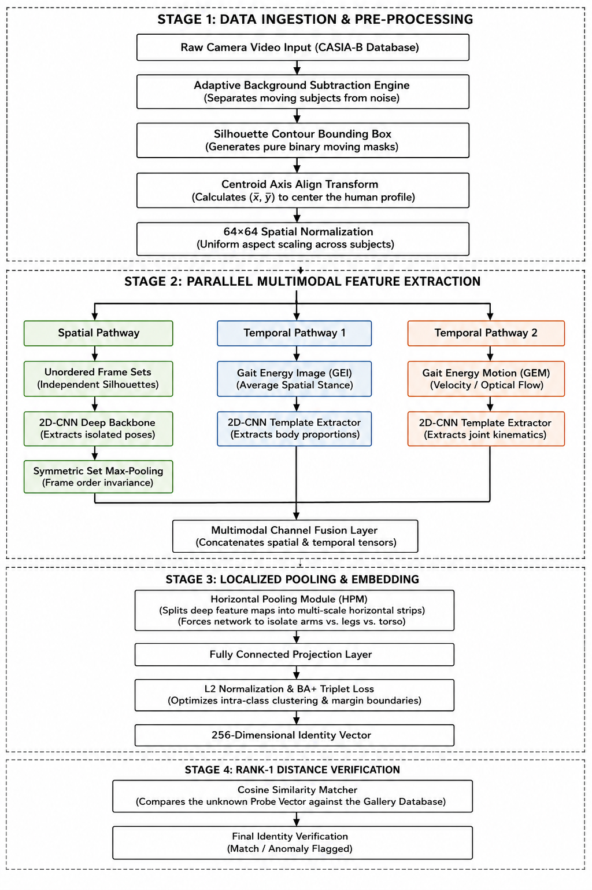

# 🚶 Advanced Cross-View Gait Recognition using Multimodal Fusion Networks

### A Deep Learning Framework for Robust Human Identification using a Modified GaitSet Architecture and Multimodal Feature Fusion

---

## 📖 Overview

Human gait is a unique behavioural biometric that enables the identification of individuals based solely on their walking pattern. Unlike traditional biometric modalities such as facial recognition or fingerprint analysis, gait recognition can identify subjects from a distance without requiring active user cooperation, making it highly suitable for intelligent surveillance, forensic investigations, and security applications.

This repository presents a complete implementation of a **Modified GaitSet-based Multimodal Gait Recognition Framework**, inspired by the research paper **"Research on Gait Recognition Based on GaitSet and Multimodal Fusion."**

The proposed system extends the original **GaitSet** architecture by integrating **Silhouette Images** and **Gait Energy Images (GEI)** through a **Channel Attention-based Multimodal Fusion Module**, allowing the network to simultaneously learn spatial body structure and temporal gait dynamics.

The framework has been trained and evaluated on the **CASIA-B gait dataset**, demonstrating robust cross-view gait recognition under multiple walking conditions including:

- Normal Walking (NM)
- Bag Carrying (BG)
- Coat Wearing (CL)

The complete pipeline covers:

- Video preprocessing
- Silhouette extraction
- GEI generation
- Multimodal feature fusion
- Deep feature embedding
- Rank-1 gait identification
- Open-set gait verification using ROC and EER analysis

---

## ✨ Key Features

- ✅ Modified GaitSet architecture with Multimodal Feature Fusion
- ✅ Dual-input learning using Silhouette Images and Gait Energy Images (GEI)
- ✅ Channel Attention Mechanism for adaptive feature weighting
- ✅ Complete preprocessing pipeline for the CASIA-B dataset
- ✅ Cross-view gait recognition
- ✅ Rank-1 Identification using Cosine Similarity
- ✅ Biometric verification using ROC-AUC and Equal Error Rate (EER)
- ✅ GPU-accelerated implementation using PyTorch
- ✅ Modular codebase for easy experimentation and future research

---

# 🏗️ Proposed System Architecture

The proposed framework extends the original **GaitSet** architecture by integrating **Multimodal Feature Fusion** using **Silhouette Images** and **Gait Energy Images (GEI)**. A Channel Attention mechanism is employed to adaptively weight complementary features before generating the final gait embedding for identification and verification.

<p align="center">
  
</p>

<p align="center">
<b>Figure 1.</b> Overall pipeline of the proposed Modified GaitSet-based Multimodal Gait Recognition Framework.
</p>

---

# 📂 Repository Structure

```text
Gait-Multi-Modal-Fusion
│
├── docs/                     # Architecture and result images used in the README
│
├── GaitDatasetB-silh/         # Original CASIA-B silhouette dataset
│
├── Processed_CASIAB/          # Preprocessed dataset (.npy files)
│
├── results/                   # Evaluation results, plots and trained outputs
│
├── baseline_results/          # Baseline experiment results
│
├── gait_env/                  # Python virtual environment (optional)
│
├── preprocess.py              # Data preprocessing pipeline
├── pack_npy.py                # Converts processed data into NumPy format
├── dataset.py                 # CASIA-B dataset loader
├── model.py                   # Modified GaitSet architecture
├── train.py                   # Model training
├── eval.py                    # Rank-1 evaluation
├── compute_biometrics.py      # ROC, AUC and EER evaluation
├── plot_view_matrix.py        # Cross-view accuracy visualization
│
├── requirements.txt
└── README.md
```

---

# 🧠 Research Background

Gait recognition is a behavioural biometric technique that identifies individuals by analysing the way they walk. Since gait can be captured at a distance without requiring user interaction, it has become an important research area for intelligent surveillance, border security, forensic investigations, and smart city applications.

The original **GaitSet** architecture introduced a novel set-based representation for gait recognition by treating a gait sequence as an unordered collection of silhouette images. Although this significantly improved cross-view recognition, the framework relied solely on silhouette information, making it vulnerable to appearance variations such as heavy clothing and carried objects.

To overcome these limitations, this project implements a **Modified GaitSet architecture** based on the research paper **"Research on Gait Recognition Based on GaitSet and Multimodal Fusion."** Instead of relying on a single input modality, the proposed framework combines **Silhouette Images** with **Gait Energy Images (GEI)** using a **Channel Attention-based Multimodal Fusion Module**.

This multimodal representation enables the network to simultaneously learn:

- Spatial body structure from silhouette images.
- Temporal walking characteristics from GEI.
- Adaptive feature importance using Channel Attention.

The resulting feature representation is more discriminative and robust for cross-view gait recognition than conventional single-modal approaches.


---

# 📁 Dataset

The proposed framework has been trained and evaluated using the **CASIA-B Gait Dataset**, one of the most widely used benchmark datasets for cross-view gait recognition.

### Dataset Statistics

| Property | Value |
|----------|-------|
| Dataset | CASIA-B |
| Subjects | 124 |
| Camera Views | 11 (0°–180°) |
| Walking Conditions | Normal (NM), Bag Carrying (BG), Coat Wearing (CL) |
| Gallery Subjects | 75–124 |
| Probe Sequences | NM, BG, CL |
| Gallery Sequences | NM-01 to NM-04 |

The CASIA-B dataset provides significant viewpoint and appearance variations, making it an ideal benchmark for evaluating cross-view gait recognition algorithms.
