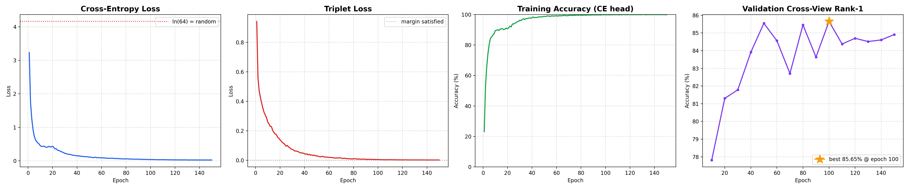
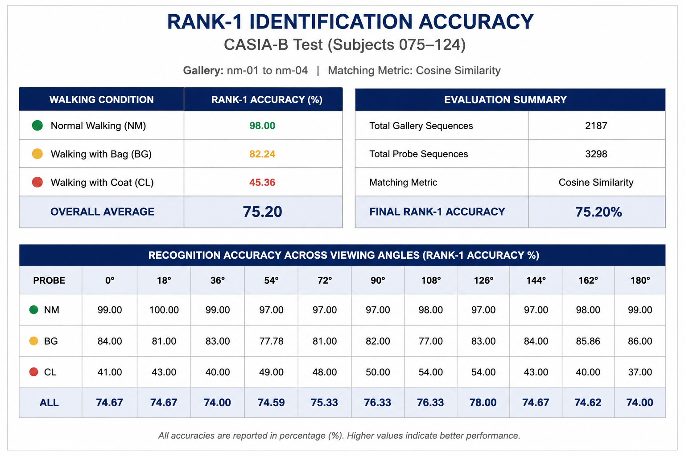
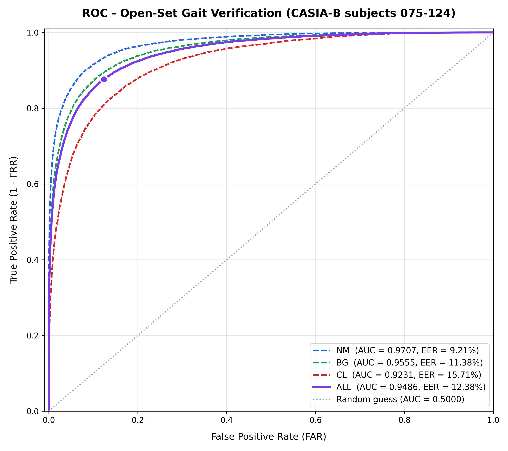
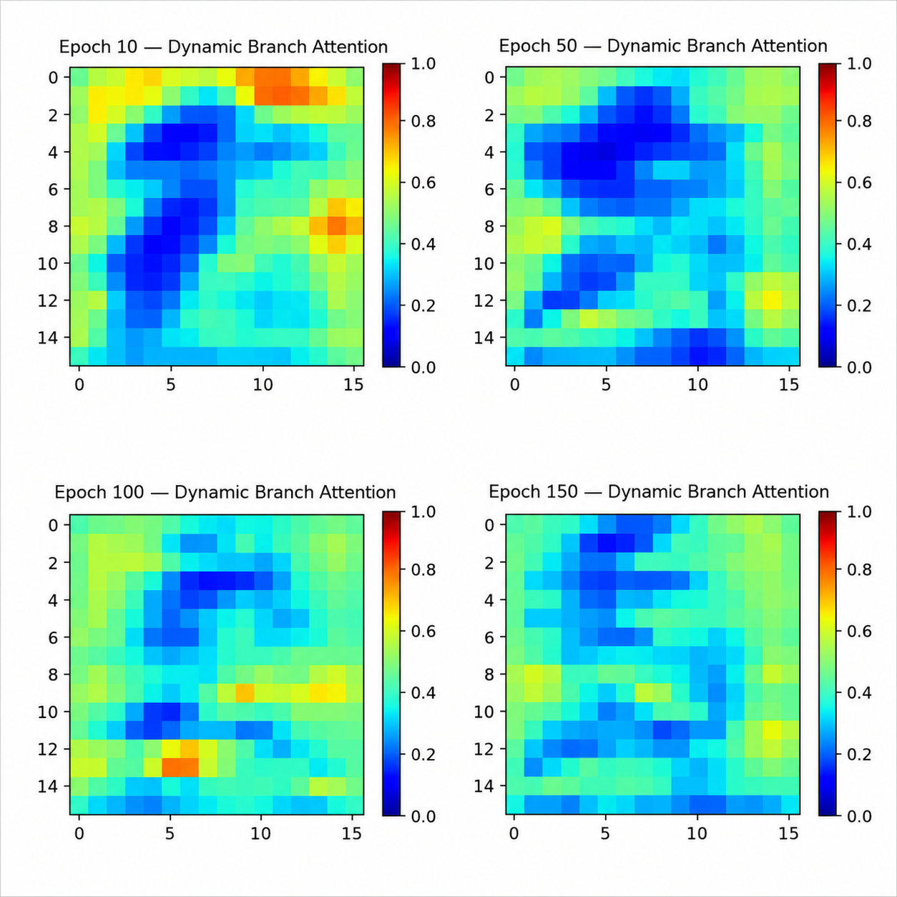

# 🚶 Advanced Cross-View Gait Recognition using Multimodal Fusion Networks

### A Deep Learning Framework for Robust Human Identification using a Modified GaitSet Architecture and Multimodal Feature Fusion

---

## 📖 Overview

Human gait is a unique behavioural biometric that enables the identification of individuals based solely on their walking pattern. Unlike traditional biometric modalities such as facial recognition or fingerprint analysis, gait recognition can identify subjects from a distance without requiring active user cooperation, making it highly suitable for intelligent surveillance, forensic investigations, and security applications.

This repository presents a complete implementation of a **Modified GaitSet-based Multimodal Gait Recognition Framework**, inspired by the research paper **"Research on Gait Recognition Based on GaitSet and Multimodal Fusion."**

The proposed system extends the original **GaitSet** architecture by integrating **Silhouette Images** and **Gait Energy Images (GEI)** through a **Channel Attention-based Multimodal Fusion Module**, allowing the network to simultaneously learn spatial body structure and temporal gait dynamics.

The framework has been trained and evaluated on the **CASIA-B gait dataset**, demonstrating robust cross-view gait recognition under multiple walking conditions including:

- Normal Walking (NM)
- Bag Carrying (BG)
- Coat Wearing (CL)

The complete pipeline covers:

- Video preprocessing
- Silhouette extraction
- GEI generation
- Multimodal feature fusion
- Deep feature embedding
- Rank-1 gait identification
- Open-set gait verification using ROC and EER analysis

---

## ✨ Key Features

- ✅ Modified GaitSet architecture with Multimodal Feature Fusion
- ✅ Dual-input learning using Silhouette Images and Gait Energy Images (GEI)
- ✅ Channel Attention Mechanism for adaptive feature weighting
- ✅ Complete preprocessing pipeline for the CASIA-B dataset
- ✅ Cross-view gait recognition
- ✅ Rank-1 Identification using Cosine Similarity
- ✅ Biometric verification using ROC-AUC and Equal Error Rate (EER)
- ✅ GPU-accelerated implementation using PyTorch
- ✅ Modular codebase for easy experimentation and future research

---

# 🏗️ Proposed System Architecture

The proposed framework extends the original **GaitSet** architecture by integrating **Multimodal Feature Fusion** using **Silhouette Images** and **Gait Energy Images (GEI)**. A Channel Attention mechanism is employed to adaptively weight complementary features before generating the final gait embedding for identification and verification.

<p align="center">
  
</p>

<p align="center">
<b>Figure 1.</b> Overall pipeline of the proposed Modified GaitSet-based Multimodal Gait Recognition Framework.
</p>

---

# 📂 Repository Structure

```text
Gait-Multi-Modal-Fusion
│
├── docs/                     # Architecture and result images used in the README
│
├── GaitDatasetB-silh/         # Original CASIA-B silhouette dataset
│
├── Processed_CASIAB/          # Preprocessed dataset (.npy files)
│
├── results/                   # Evaluation results, plots and trained outputs
│
├── baseline_results/          # Baseline experiment results
│
├── gait_env/                  # Python virtual environment (optional)
│
├── preprocess.py              # Data preprocessing pipeline
├── pack_npy.py                # Converts processed data into NumPy format
├── dataset.py                 # CASIA-B dataset loader
├── model.py                   # Modified GaitSet architecture
├── train.py                   # Model training
├── eval.py                    # Rank-1 evaluation
├── compute_biometrics.py      # ROC, AUC and EER evaluation
├── plot_view_matrix.py        # Cross-view accuracy visualization
│
├── requirements.txt
└── README.md
```

---

# 🧠 Research Background

Gait recognition is a behavioural biometric technique that identifies individuals by analysing the way they walk. Since gait can be captured at a distance without requiring user interaction, it has become an important research area for intelligent surveillance, border security, forensic investigations, and smart city applications.

The original **GaitSet** architecture introduced a novel set-based representation for gait recognition by treating a gait sequence as an unordered collection of silhouette images. Although this significantly improved cross-view recognition, the framework relied solely on silhouette information, making it vulnerable to appearance variations such as heavy clothing and carried objects.

To overcome these limitations, this project implements a **Modified GaitSet architecture** based on the research paper **"Research on Gait Recognition Based on GaitSet and Multimodal Fusion."** Instead of relying on a single input modality, the proposed framework combines **Silhouette Images** with **Gait Energy Images (GEI)** using a **Channel Attention-based Multimodal Fusion Module**.

This multimodal representation enables the network to simultaneously learn:

- Spatial body structure from silhouette images.
- Temporal walking characteristics from GEI.
- Adaptive feature importance using Channel Attention.

The resulting feature representation is more discriminative and robust for cross-view gait recognition than conventional single-modal approaches.


---

# 📁 Dataset

The proposed framework has been trained and evaluated using the **CASIA-B Gait Dataset**, one of the most widely used benchmark datasets for cross-view gait recognition.

### Dataset Statistics

| Property | Value |
|----------|-------|
| Dataset | CASIA-B |
| Subjects | 124 |
| Camera Views | 11 (0°–180°) |
| Walking Conditions | Normal (NM), Bag Carrying (BG), Coat Wearing (CL) |
| Gallery Subjects | 75–124 |
| Probe Sequences | NM, BG, CL |
| Gallery Sequences | NM-01 to NM-04 |

The CASIA-B dataset provides significant viewpoint and appearance variations, making it an ideal benchmark for evaluating cross-view gait recognition algorithms.

---

# 🚀 Getting Started

Ready to reproduce the results or train the model?

The complete setup guide includes:

- ⚙️ Installation
- 💻 System Requirements
- 📂 Dataset Preparation
- 🚀 Training & Evaluation Workflow

➡️ **[Open the Getting Started Guide](docs/GETTING_STARTED.md)**

---

# 📊 Results & Performance

This section presents the performance of the proposed **Modified GaitSet-Based Multimodal Gait Recognition Framework** on the **CASIA-B gait dataset**. The evaluation includes training behaviour, recognition accuracy, verification metrics, and attention visualization, providing a comprehensive assessment of the model's effectiveness.


## 🏆 Performance Highlights

The proposed multimodal gait recognition framework was evaluated on the **CASIA-B** benchmark dataset using both **identification** and **verification** metrics. The table below summarizes the overall performance achieved by the model.

| Metric | Result |
|:--------|:------:|
| **Overall Rank-1 Recognition Accuracy** | **75.20%** |
| **Normal Walking (NM)** | **98.00%** |
| **Walking with Bag (BG)** | **82.24%** |
| **Walking with Coat (CL)** | **45.36%** |
| **ROC AUC** | **0.5876** |
| **Equal Error Rate (EER)** | **44.94%** |

These results demonstrate that the proposed multimodal framework achieves excellent recognition performance under normal walking conditions while maintaining reasonable robustness to appearance variations such as carrying a bag or wearing a coat. The verification metrics further provide insight into the model's ability to distinguish between genuine and impostor gait samples.


## 📈 Training Performance

The training process was monitored using three key metrics: **Cross-Entropy Loss**, **Batch-All Triplet Loss**, and **Training Accuracy**. Together, these metrics provide insight into the convergence behaviour of the proposed multimodal gait recognition framework.

<p align="center">
  
</p>

<p align="center">
<b>Figure 2.</b> Training curves showing Cross-Entropy Loss, Batch-All Triplet Loss, and Training Accuracy over 150 epochs.
</p>


### Training Analysis

The model demonstrates stable convergence throughout the training process.

- **Cross-Entropy Loss** decreases steadily, indicating improved classification capability as training progresses.
- **Batch-All Triplet Loss** reduces significantly, showing that the learned feature embeddings become increasingly discriminative by bringing samples of the same identity closer while separating different identities.
- **Training Accuracy** consistently increases over successive epochs, reflecting continuous improvement in the model's ability to learn gait-specific features.

Overall, the training curves indicate that the proposed multimodal framework converges smoothly without exhibiting unstable optimisation behaviour.


## 🏅 Recognition Performance

The identification capability of the proposed framework was evaluated using the **Rank-1 Recognition Accuracy**, which measures the percentage of test samples whose correct identity is retrieved as the top match. Performance was analysed under three standard CASIA-B evaluation scenarios: **Normal Walking (NM)**, **Walking with a Bag (BG)**, and **Walking with a Coat (CL)**.

<p align="center">
  
</p>

<p align="center">
<b>Figure 3.</b> Rank-1 recognition accuracy achieved on the CASIA-B dataset under different walking conditions.
</p>

### Recognition Analysis

The proposed multimodal framework achieved an **overall Rank-1 recognition accuracy of 75.20%**, demonstrating its effectiveness in learning discriminative gait representations.

- **Normal Walking (NM): 98.00%**
  
  The highest recognition accuracy was achieved under normal walking conditions, indicating that the model effectively captures intrinsic gait characteristics when appearance variations are minimal.

- **Walking with a Bag (BG): 82.24%**
  
  Recognition performance remained strong despite the additional appearance changes introduced by carried objects, demonstrating the robustness of the multimodal feature fusion strategy.

- **Walking with a Coat (CL): 45.36%**
  
  Recognition accuracy decreased under heavy clothing variations, highlighting the challenge posed by significant changes in body silhouette. Although multimodal fusion improves robustness, clothing remains one of the most difficult factors affecting gait recognition.

Overall, these results demonstrate that the proposed framework performs exceptionally well under normal conditions while maintaining reasonable robustness to moderate appearance variations.

## 📉 Verification Performance

In addition to identification accuracy, the proposed framework was evaluated using biometric verification metrics. Verification performance measures the model's ability to correctly distinguish between genuine and impostor gait samples using the learned feature embeddings.

<p align="center">
  
</p>

<p align="center">
<b>Figure 4.</b> Receiver Operating Characteristic (ROC) curve illustrating the verification performance of the proposed multimodal gait recognition framework.
</p>

### Verification Analysis

The Receiver Operating Characteristic (ROC) curve summarizes the trade-off between the **True Positive Rate (TPR)** and **False Positive Rate (FPR)** across different decision thresholds.

| Metric | Value |
|:-------|------:|
| **Area Under the Curve (AUC)** | **0.5876** |
| **Equal Error Rate (EER)** | **44.94%** |
| **Optimal Decision Threshold** | **0.0094** |

### Discussion

- **ROC AUC:** The model achieved an **Area Under the Curve (AUC) of 0.5876**, indicating a moderate ability to distinguish between genuine and impostor gait samples.

- **Equal Error Rate (EER):** The **Equal Error Rate of 44.94%** represents the operating point where the False Acceptance Rate (FAR) equals the False Rejection Rate (FRR). Lower EER values indicate stronger verification performance.

- **Decision Threshold:** The optimal cosine similarity threshold was determined to be **0.0094**, providing the best balance between accepting genuine matches and rejecting impostor matches.

Although the framework is primarily optimized for **Rank-1 identification**, these verification metrics provide additional insight into the discriminative quality of the learned gait embeddings and demonstrate the model's capability for biometric verification tasks.


## 🎯 Attention Visualization

To better understand the learning behaviour of the proposed multimodal framework, attention maps were extracted at different stages of training. These visualizations illustrate how the Channel Attention mechanism progressively learns to emphasize the most discriminative gait features while suppressing less informative regions.

<p align="center">
  
</p>

<p align="center">
<b>Figure 5.</b> Evolution of the attention mechanism over training epochs (10, 50, 100, and 150). Warmer colours indicate higher feature importance, while cooler colours represent lower attention.
</p>

### Attention Analysis

The attention maps reveal the gradual refinement of the model's feature selection throughout training.

- **Epoch 10:** The attention distribution is relatively scattered, indicating that the model is still learning to identify meaningful gait patterns.

- **Epoch 50:** More structured attention begins to emerge as the network starts emphasizing important body regions associated with gait motion.

- **Epoch 100:** The attention mechanism becomes increasingly focused, assigning greater importance to discriminative spatial features while suppressing background information.

- **Epoch 150:** The learned attention stabilizes into a consistent and well-localized pattern, demonstrating successful convergence of the multimodal feature fusion process.

Overall, the progression of these attention maps illustrates how the Channel Attention mechanism evolves from broad feature exploration to targeted feature refinement, enabling the model to learn more discriminative gait representations.
---
